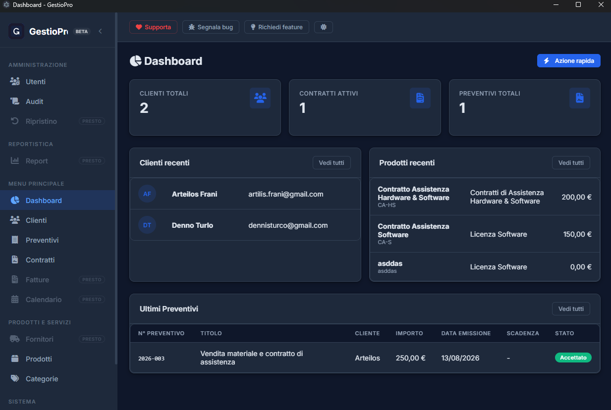
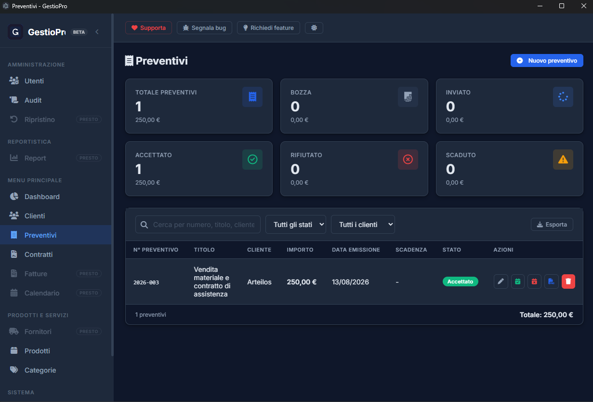
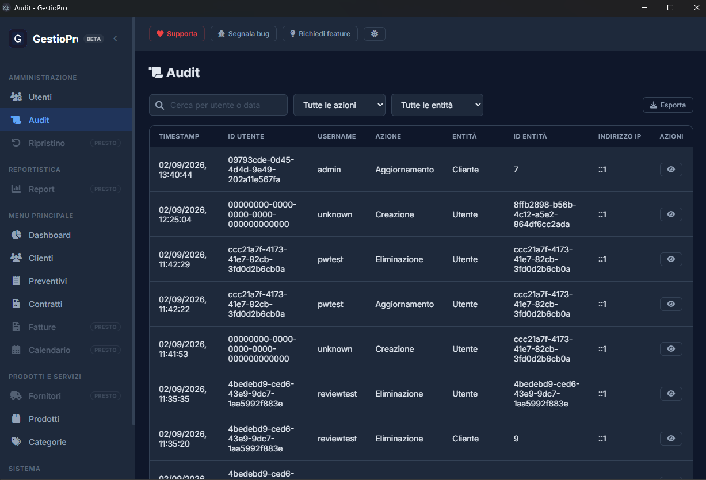
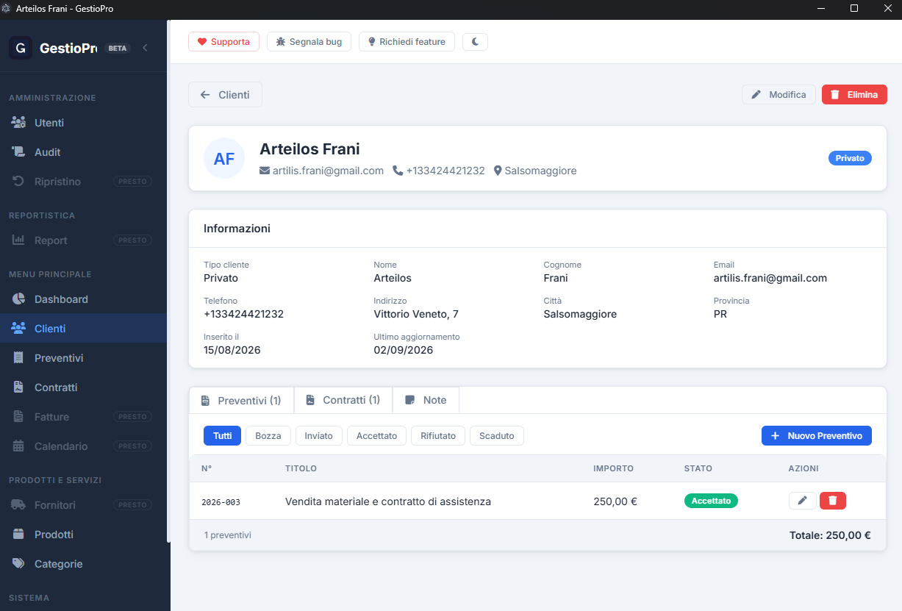

Business management application for **freelancers and self-employed professionals**, available both as a **web app** and as a **Windows desktop app**.

---

## Features

- **Dashboard**: at-a-glance overview of the business (customers, quotations, contracts).
- **Customers**: full customer registry (private, company, freelancer, public admin), each with a detail page listing their quotations and contracts.
- **Quotations**: create quotations from a product/service catalog, track their status (draft, sent, accepted, rejected, expired), and export them as professional PDFs with your company logo, contact details and signature fields.
- **Contracts**: manage active contracts generated from accepted quotations, including renewals.
- **Products & Categories**: a catalog of products/services with pricing and categorization, used when building quotations.
- **Company settings**: company name, address, VAT number, contacts, default VAT rate, default quotation validity/notes, and a company logo upload used across generated PDFs.
- **Users & roles**: Admin and Operator roles; Operators have read/limited access to sensitive areas.
- **Audit log** *(Admin only)*: a full history of who created, changed or deleted what and when, with before/after values.
- **Dark mode**: light/dark theme toggle, remembered across sessions.
- **Desktop app**: installs like a normal Windows application, starts automatically at login, and lives in the system tray (Apri/Esci) instead of cluttering the taskbar.

---

## Screenshots

|  |  |
| ------------------------ | ------------------------ |
|  |  |

---

## Getting started

**Prerequisites**: .NET SDK 10+, Node.js 18+, PostgreSQL 15+ (or Docker).

1. Start a PostgreSQL database (see `docker-compose.yml` if you use Docker), then apply the database migrations:
   ```bash
   dotnet ef database update --project GestioPro.Infrastructure --startup-project GestioPro.Api
   ```
2. Run the backend:
   ```bash
   cd GestioPro.Api && dotnet run
   ```
3. Run the frontend:
   ```bash
   cd frontend && npm install && npm run dev
   ```
4. Open **http://localhost:3000** and create your first account from the login page (there is no default user).

If you're working in VS Code, the **"Avvia tutto"** task (`.vscode/tasks.json`) starts the database container, backend and frontend together in one go.

To run it as a desktop app instead of in the browser: `cd frontend && npm run electron:dev` (with the backend already running).

---

For architecture, project structure, API details, database schema, the Electron/tray/auto-start/heartbeat internals and build/installer instructions, see [code_documentation.md](code_documentation.md).
