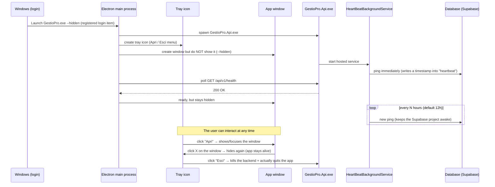

# GestioPro — Technical Documentation

High-level overview of the project's architecture, meant as a quick orientation guide to the codebase.

## What it is

GestioPro is a business management application (customers, quotations, contracts, products, audit log) distributed as:

- **Windows desktop app** (Electron), the primary use case — runs in the background with a tray icon and starts automatically on PC boot.
- **Web app** — the same frontend can also be served over a browser, pointing at the same backend.

## Tech stack

| Layer | Technology |
|---|---|
| Frontend | React 18 + TypeScript + Vite |
| Desktop shell | Electron |
| Backend | ASP.NET Core Web API (.NET, C#) |
| ORM | Entity Framework Core (code-first, migrations) |
| Database | PostgreSQL (local in development, Supabase in production) |
| Auth | JWT (Bearer token) |
| Installer | Inno Setup |

## Repository structure

```
GestioPro/
├─ GestioPro.Api/              ASP.NET Core Web API — Controllers, Program.cs, appsettings
├─ GestioPro.Common/           DTOs, Models (EF entities), Enums, Interfaces, Helpers, Exceptions
├─ GestioPro.Infrastructure/   AppDbContext, Migrations, Service implementations
├─ GestioPro.ApiTests/         (orphan: no .csproj, not part of the solution)
├─ GestioPro.InfrastructureTests/  xUnit tests for the Services (in-memory DB)
├─ frontend/
│  ├─ src/pages/               One React page per section (Clienti, Preventivi, ...)
│  ├─ src/services/api.ts      HTTP client towards the backend (fetch)
│  ├─ src/context/             AuthContext, ToastContext
│  └─ electron/main.js         Electron main process (window, tray, backend startup)
├─ installer/GestioPro.iss     Inno Setup script that generates the setup.exe
└─ .vscode/tasks.json          "Avvia tutto" task (DB + backend + frontend in parallel)
```

## Backend (GestioPro.Api / Common / Infrastructure)

Three-layer architecture:

- **Controllers** (`GestioPro.Api/Controllers`) — one REST controller per entity (`CustomersController`, `QuotationsController`, `ContractController`, `ProductsController`, `ProductCategoriesController`, `ContractRenewalController`, `SettingsController`, `UsersController`, `AuditController`, `AuthController`, `HeartBeatController`). Thin: validate the request and delegate to the service.
- **Services** (`GestioPro.Infrastructure/Services`) — business logic, an interface in `GestioPro.Common/Interfaces` plus one implementation. They use `AppDbContext` directly (no separate repository layer).
- **Models / DTOs** (`GestioPro.Common`) — `Models` are the EF Core entities (mapped 1:1 to tables), `DTOs` are the records exposed by the API (never the raw entities, except a few historical exceptions).

**Authentication**: JWT Bearer configured in `Program.cs`. A **fallback authorization policy** requires an authenticated user on every endpoint by default — `[AllowAnonymous]` is only on `POST /auth/login` and `POST /auth/register`. Extra role checks (`[Authorize(Roles = "Admin")]`) are layered on top where needed (`AuditController`, and the admin-only actions in `UsersController`: create, delete, force-update). Public self-registration always creates an `Operator` — the role in the request body is ignored, so nobody can self-elevate to Admin. Since there's never a "first" Admin to promote you, bootstrapping the very first Admin account has to be done directly on the database (see **First Admin user** below).

**Audit log**: `AuditService` writes a row to the `audit` table on every relevant Create/Update/Delete (who, when, what, before/after values), browsable from the Audit page (Admin only).

**Migrations**: EF Core code-first. Default data seeding (company settings, the heartbeat row) lives in `AppDbContext.OnModelCreating` via `HasData`.

## Frontend (React + Vite)

- Routing with `react-router-dom` (`App.tsx`), one page per route under `src/pages`.
- `RequireRole` guards routes reserved for Admins (e.g. `/utenti`, `/audit`) — this must always be mirrored on the backend with `[Authorize(Roles=...)]`, otherwise the page is merely hidden while the API stays directly callable.
- `src/services/api.ts` centralizes all HTTP calls (one object per entity: `ClientiAPI`, `QuotationAPI`, `SettingsAPI`, ...).
- In dev, Vite proxies to `https://localhost:7160` (see `vite.config.ts`); in production the Electron app loads the static files from `dist/`.
- Quotation PDF generation happens client-side with `html2pdf.js` (logo, company data and footer pulled from Settings).

## Desktop app (Electron)

`frontend/electron/main.js` is the main process:

- **Dev** (`npm run electron:dev`): opens only the window pointed at Vite (`localhost:3000`); the backend must be started separately (dotnet run, or the VS Code "Avvia tutto" task).
- **Production** (installed package): also launches the backend as a child process (`GestioPro.Api.exe`, published under `resources/backend`), waits for it to respond on `/api/v1/health`, then shows the window.
- **Tray icon**: always created, with an "Apri" / "Esci" menu. Closing the window (X) hides it to the tray instead of terminating the app; only "Esci" actually quits (app + backend process).
- **Auto-start**: in production the app registers itself as a Windows login item (`app.setLoginItemSettings`), passing the `--hidden` flag, so on PC reboot it starts in the background without opening the window.

## Database and Heartbeat (Supabase)

In production the backend points at a Postgres project on Supabase (connection string in `appsettings.Production.json`, not committed — see the `.example` file). Supabase free-tier projects pause after a period of inactivity: to avoid that, `HeartBeatBackgroundService` (a .NET hosted service) writes a timestamp to the `heartbeat` table right at startup and then periodically (default every 12h, configurable in `appsettings.json` → `HeartBeat:IntervalHours`), for as long as the backend process stays alive.

Since the app auto-starts in the background on every PC boot (see above), the database stays "alive" even if nobody ever opens the window.

### What happens at PC startup



## Environments: Development vs Production

ASP.NET Core's standard config layering: `appsettings.json` (base, committed — safe placeholder secrets only) → `appsettings.{ASPNETCORE_ENVIRONMENT}.json` (overlay) → environment variables (highest precedence). Two overlays exist:

- `appsettings.Development.json` — committed, local-dev-only values.
- `appsettings.Production.json` — **not committed** (`.gitignore`'d), holds the real Supabase connection string and JWT secret. Create it by copying [appsettings.Production.json.example](GestioPro.Api/appsettings.Production.json.example) and filling in the real values. Never put real credentials in the `.example` file — that one *is* committed.

`ASPNETCORE_ENVIRONMENT` decides which overlay loads. **Gotcha**: if it's unset, ASP.NET Core defaults to `Production`. Local `dotnet run` / F5 debugging only stays on `Development` because `GestioPro.Api/Properties/launchSettings.json` sets it explicitly per profile — if that file is ever missing, malformed (e.g. someone adds a `//` comment, which isn't valid JSON), or you bypass it (running the built DLL directly), you silently fall back to `Production` and start reading/writing **the real Supabase database** from your dev machine. Always check the startup log line `Hosting environment: ...` before assuming which database you're talking to.

To deliberately run against Production locally (e.g. for one-off admin tasks) without touching your normal dev workflow, override the config via environment variables instead of touching `ASPNETCORE_ENVIRONMENT`/`appsettings`:

```bash
ASPNETCORE_ENVIRONMENT=Production \
ASPNETCORE_URLS=http://localhost:5298 \
ConnectionStrings__Default="Host=...;Port=5432;Database=postgres;Username=...;Password=...;SSL Mode=Require;Trust Server Certificate=true" \
Jwt__Secret="<production secret>" \
dotnet bin/Release/net10.0/GestioPro.Api.dll
```
(Build the Release configuration first with `dotnet build GestioPro.Api -c Release` — using a separate build output and a non-default port avoids colliding with a `Debug` build/session you may already have running.)

## Supabase setup (from scratch)

1. Create a project at [supabase.com](https://supabase.com); note the database password you set.
2. **Project Settings → Database → Connection string.** Use the **Session pooler** tab (port 5432), not "Direct connection" — new Supabase projects resolve the direct-connection hostname (`db.<ref>.supabase.co`) to an **IPv6-only address**, which fails to resolve on networks/ISPs without proper IPv6 support. The Session pooler hostname (`aws-<n>-<region>.pooler.supabase.com`) is IPv4-compatible. Don't use the "Transaction pooler" (port 6543) either — it doesn't support the prepared statements EF Core migrations need.
3. Convert the copied URI into the Npgsql key-value format and put it in `appsettings.Production.json`:
   ```
   Host=aws-<n>-<region>.pooler.supabase.com;Port=5432;Database=postgres;Username=postgres.<project-ref>;Password=<db-password>;SSL Mode=Require;Trust Server Certificate=true
   ```
4. Apply migrations: `dotnet ef database update --project GestioPro.Infrastructure --startup-project GestioPro.Api --connection "<connection string above>"`.

## First Admin user

Public registration (`POST /auth/register`) always creates an `Operator`, by design — there's no API path to create the first Admin. Bootstrap it once, directly on the database:

1. Register a normal account (UI "Registrati", or `POST /auth/register`).
2. Promote it with SQL: `UPDATE users SET "UserRole" = 1 WHERE "Username" = '<username>';` (`1` = Admin, `2` = Operator — see `GestioPro.Common/Enums/UserRole.cs`). From then on, every other Admin can be created normally through the Utenti page.

## Release checklist

1. **Database**: Supabase project set up, migrations applied, `appsettings.Production.json` filled in (see above), first Admin bootstrapped.
2. **Publish the backend** — `./publish_backend.ps1`, which runs:
   ```
   dotnet publish GestioPro.Api -c Release -r win-x64 --self-contained false -o GestioPro.Api/bin/Release/net10.0/win-x64/publish
   ```
   `appsettings.Production.json` is picked up automatically since it lives in `GestioPro.Api/`. Note `--self-contained false`: the target Windows machine needs the .NET runtime installed — switch to `--self-contained true` if you'd rather ship a larger installer that needs nothing preinstalled on the end user's PC.
3. **Build the Electron app** — `./build_electron.ps1` (i.e. `cd frontend && npm run electron:build`) → Vite build + electron-builder in `dir` mode, produces `frontend/dist-electron/win-unpacked/` (the full Electron app, backend included under `resources/backend`).

   **If the repo lives inside a OneDrive-synced folder** (e.g. under `Documents`), this step can fail with `EBUSY: resource busy or locked, unlink ... app.asar` — OneDrive briefly locks the freshly-written `app.asar` while it hashes/uploads it, and the lock can outlast the build. If deleting `frontend/dist-electron` and retrying doesn't clear it, build to a location outside the synced folder instead:
   ```
   npx electron-builder --dir --win -c.directories.output="$env:TEMP\gestiopro-dist-electron"
   ```
4. **Compile the installer** — open [installer/GestioPro.iss](installer/GestioPro.iss) in Inno Setup Compiler, Ctrl+F9 → `installer/Output/GestioPro_Setup_<version>.exe`. If you built to an alternate output dir in step 3 (OneDrive workaround), pass it as a preprocessor override instead of editing the script:
   ```
   ISCC.exe "/DSourceDir=$env:TEMP\gestiopro-dist-electron\win-unpacked" installer\GestioPro.iss
   ```
5. **Test the installer** before distributing it: install on a clean-ish machine (or reinstall locally), check the app starts, tray icon is present, login works against Supabase, autostart is registered (`HKCU\Software\Microsoft\Windows\CurrentVersion\Run\electron.app.GestioPro`, pointing at the install dir with `--hidden`), and the backend log shows heartbeat pings. Then uninstall and confirm that registry value is gone too (the installer cleans it up even though Electron, not the installer, is the one who created it).

## Local development

`.vscode/tasks.json` → the **"Avvia tutto"** task starts, in parallel, in separate panels:
- the local Postgres container (`docker start postgres-gestiopro`)
- the backend (`dotnet run --project GestioPro.Api --launch-profile https`, port 7160)
- the frontend (`npm run dev`, Vite on port 3000)

`.vscode/launch.json` also has "Run Desktop" to start the Electron shell once frontend and backend are already up.
